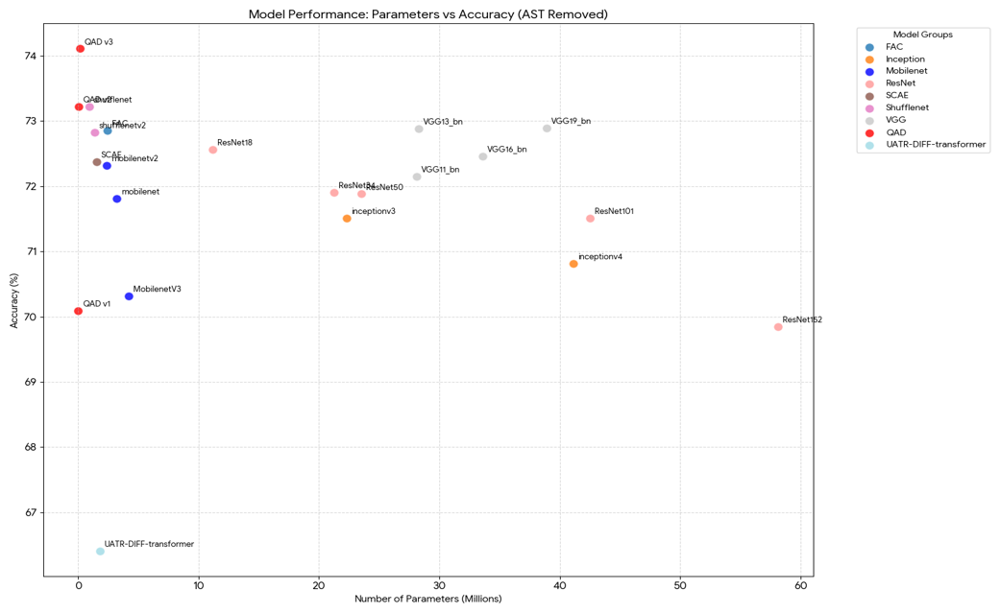

<!-- [](논문_링크) -->
<h1 align="left">QAD : Quantization Adversarial Distillation for Embedded Underwater Acoustic Target Recognition</h1>

>  Official Implementation of<br>
>  - **Quantization Adversarial Distillation for Embedded Underwater Acoustic Target Recognition** <br>
>    (Minor Revision to IEEE ESL 2026) <br>
>    by Dongjun Kim, Sung-Hoon Byun, Sangwook Park


## Overview
<p align="center">
  
</p>

To address the challenges of resource-constrained UATR sensing platforms, we propose **Quantization Adversarial Distillation (QAD)**, a novel framework that integrates **knowledge distillation (KD)** and **quantization-aware training (QAT)** with **Adversarial Training** to achieve both significant model compression and enhanced recognition performance.

## Key Contributions
* **Quantization-Adversarial Distillation:** Our QAD jointly integrates Knowledge Distillation, Adversarial Distillation, and Quantization Aware Training to restore the information loss when decreasing the model size.

* **Optimized Latency-Accuracy Trade-off:** QAD V3 compresses the model size to **37%** and reduces inference latency to **44%** compared to the full-precision baseline, while simultaneously enhancing classification accuracy to **74.11 ± 0.28%**.

* **Real-World Edge Deployment:** Validates practical embedded feasibility by deploying and measuring the classification accuracy and execution latency on a commercial edge hardware platform, the **Raspberry Pi 5**.

## Results

Model	Strategy	dtype	MACs	Size	Server Acc (%)	Rasp. Acc (%)	Latency (ms)
ShuffleFAC V3	Ref	FP32	9.85M	636 KB	71.64 ± 1.92	71.64 ± 1.92	11.24 ± 0.05
ShuffleFAC V3	QAD	INT8	9.85M	238 KB	74.11 ± 0.28	74.09 ± 0.29	4.94 ± 0.08
ShuffleFAC V2	Ref	FP32	3.06M	226 KB	71.85 ± 0.85	71.85 ± 0.85	8.06 ± 0.05
ShuffleFAC V2	QAD	INT8	3.06M	113 KB	73.22 ± 0.26	73.22 ± 0.29	3.02 ± 0.07
ShuffleFAC V1	Ref	FP32	1.06M	116 KB	65.71 ± 2.10	65.71 ± 2.10	6.69 ± 0.04
ShuffleFAC V1	QAD	INT8	1.06M	74 KB	70.09 ± 0.29	70.08 ± 0.32	2.37 ± 0.08

† Measured on Raspberry Pi 5, single-core (taskset -c 0), CPU fixed at 1.5 GHz, DVFS disabled.

<p align="center">
  
</p>

<p align="center">
  
</p>

Our work compared various baseline models (including VGGNet, ResNet, InceptionNet, MobileNet, ShuffleNet, SCAE, MicroNet, UATR-DIFF-Transformer, and AST). The figure above shows that our QAD V3 model achieved the best classification accuracy (**74.11 ± 0.28%**) on the DeepShip dataset while maintaining a significantly smaller model size.

## Repository Structure
```text
edge-qad/
├── assets/          # Figures for .md
├── checkpoints/     # Pretrained model weights (.pt)
├── configs/         # YAML config files
├── data/            # Dataset preprocessing & trainset split 
├── scripts/         # Training shell scripts (.sh)
├── src/             # Model definitions and training logic
│   ├── FAC.py       # FAC(Frequency Aware Convolution) implementation 
│   ├── losses.py    # KD, QAD loss 
|   ├── models.py    # build model for QAD (QuantStub, DeQuantStub)
|   ├── shuffleFAC.py # ShuffleFAC model
|   ├── train_engine.py # def train,valid,test,ad_train, kd_train
├── utils/           # Calculate MACs and parameters
├── environment.yml  # Conda environment
└── train.py         # Main training 

```

## Installation
1. Clone this repository and go to QAD folder
```bash
git clone https://github.com/KNU-LMAP/edge-qad.git
cd edge-qad/
```
2. Create a conda environment and install requirements
```bash
conda env create -f environment.yml
conda activate QAD
```
## Dataset 
1. To reproduce the results, ensure your dataset follows the **Directory Structure** below.
```text
DeepShip/
├── Cargo/
│   ├── 1.wav
│   ├── 2.wav
│   └── ...
├── Passengership/
│   ├── 1.wav
│   ├── 2.wav
│   └── ...
├── Tug/
│   ├── 1.wav
│   ├── 2.wav
│   └── ...
└── Tanker/
    ├── 1.wav
    ├── 2.wav
    └── ...
```
2. Go to data/ directory.
3. Run split_data.py. (Ensure you set the raw_data_root and output_root inside the script or via arguments.)
```bash
cd data/
python split_data.py
```

## Training
1. Go to scripts/ directory
```bash
cd ../scripts/
```
2. Open the desired .sh file and set your data_root to the preprocessing output root.
3. Run *.sh
```bash
chmod +x *.sh
./train_qad.sh    # 5 iterations for QAD (V3 to V1)
./train_kd.sh     # 5 iterations for KD(Knowledge Distillation, V3 to V1)
./train_qat.sh    # 5 iterations for QAT (V3 to V1)
./train_ref.sh    # 5 iterations for ShuffleFAC (V3 to V1)
./train_ad.sh     # 5 iterations for AD(Adversarial Distillation)
```


## Third-Party Code
_Our CQTF (Computation-Quantized Training Framework) implementation is heavily based on and adapted from the official repository: [Xingzhi-Zhou/CQTF_PyTorch](https://github.com/Xingzhi-Zhou/CQTF_PyTorch)._

## 🙏 Acknowledgements
This research was supported by Basic Science Research Program through the National Research Foundation of Korea (NRF) and other institutions.

## Citation
